# 基于java的公寓报修管理系统

#### 介绍

随着公寓数量的不断增加和居住环境的日益复杂，公寓的设施维修和管理变得愈发重要。传统的报修方式往往存在信息不准确、处理不及时、流程不规范等问题，给住户和管理方带来了诸多不便。为了提高公寓维修管理的效率和质量，我们开发了基于 Java 的公寓报修管理系统。
然而，当前的一些公寓报修系统在功能的全面性、用户交互的友好性以及数据的安全性等方面仍有待改进。本系统致力于填补这些空白，提供一个高效、便捷且可靠的解决方案。

#### 技术栈

后端技术栈：Springboot+Mysql+Maven

前端技术栈：Vue+Html+Css+Javascript+ElementUI

开发工具：Idea+Vscode+Navicate

#### 系统功能介绍

（一）管理端  
个人中心：管理端人员可以在个人中心查看和修改自己的个人信息，查看系统操作记录和通知。  
住户管理：对公寓内的住户信息进行登记、修改和删除，包括住户姓名、联系方式、房间号等。  
房间信息管理：维护公寓房间的基本信息，如房间位置、面积、户型等，以及房间的租赁状态和设施配备情况。  
维修人员管理：负责维修人员的信息录入、工作安排、绩效评估等。  
维修分类管理：对维修项目进行分类，如水电维修、门窗维修、管道维修等，便于准确记录和统计维修类型。  
物品信息管理：管理维修所需的物品信息，包括物品名称、库存数量、采购价格等。  
维修申请管理：接收和审核住户提交的维修申请，了解维修需求的详细情况。  
维修分配管理：根据维修申请的类型和紧急程度，合理分配维修任务给维修人员。  
改派申请管理：处理维修人员提出的改派申请，重新安排维修任务。  
请假信息管理：审批维修人员的请假申请，合理调整维修人员的工作安排。  
维修记录管理：记录每次维修的详细情况，包括维修时间、维修人员、维修结果等。  
维修评价管理：查看住户对维修服务的评价，及时了解维修服务的质量。  

（二）住户端  
个人中心：住户可以在个人中心修改个人信息、查看维修申请记录和评价记录。  
房间信息管理：查看所居住房间的详细信息，了解房间设施的配备情况。  
维修申请管理：填写维修申请，详细描述维修问题和需求，提交给管理端。  
维修记录管理：查看自己提交的维修申请的处理进度和维修结果。  
维修评价管理：对维修服务进行评价，反馈维修人员的工作表现和服务质量。  

（三）维修人员端  
个人中心：维修人员在个人中心可以修改个人信息、查看工作安排和请假记录。  
维修分配管理：查看分配给自己的维修任务，了解维修的详细要求和紧急程度。  
改派申请管理：当遇到特殊情况无法完成分配的维修任务时，提交改派申请。  
请假信息管理：向管理端提交请假申请，说明请假原因和时间。  
维修记录管理：记录自己完成的维修工作的详细情况，包括维修时间、维修内容和使用的物品等。  
维修评价管理：查看住户对自己维修服务的评价，以便不断改进工作。  

#### 系统作用

提高报修处理效率  
实现报修流程的自动化和信息化，减少人工干预，提高维修申请的处理速度。  

提升服务质量  
便于住户对维修服务进行评价，促进维修人员提高服务水平，提升住户满意度。

优化资源配置  
合理分配维修人员和维修任务，提高维修资源的利用效率。

增强管理透明度  
维修记录和评价的公开，使维修工作更加透明，便于管理方进行监督和管理。

数据统计与分析  
为公寓管理方提供维修数据的统计和分析，有助于发现设施维修的规律和问题，提前做好预防和维护工作。

#### 系统功能截图

代码结构

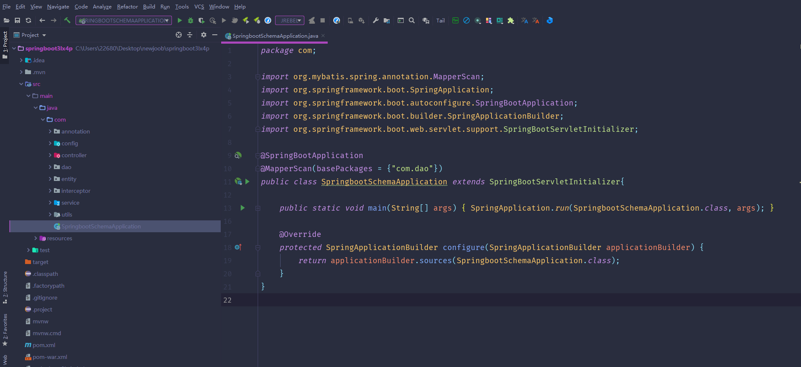

数据库表

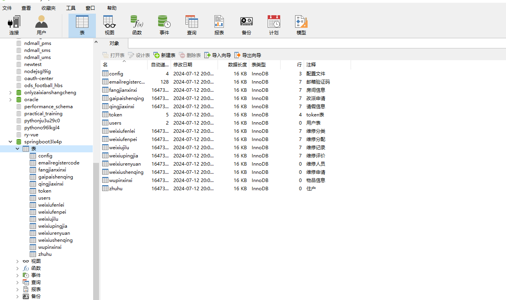

登录

住户端个人信息

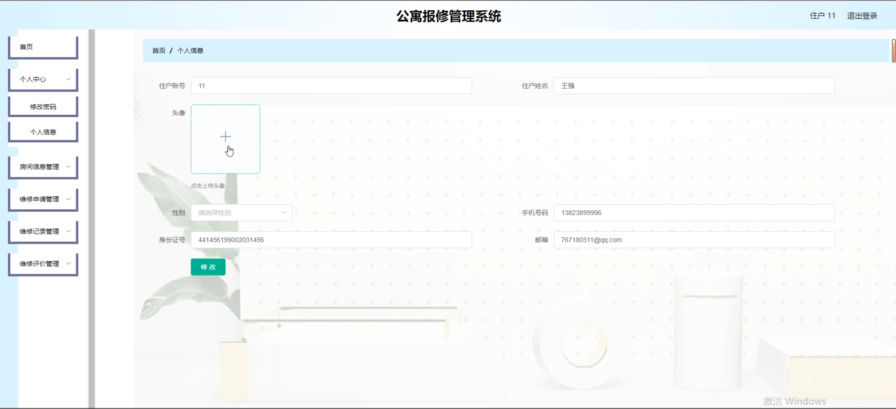

管理员端房间信息

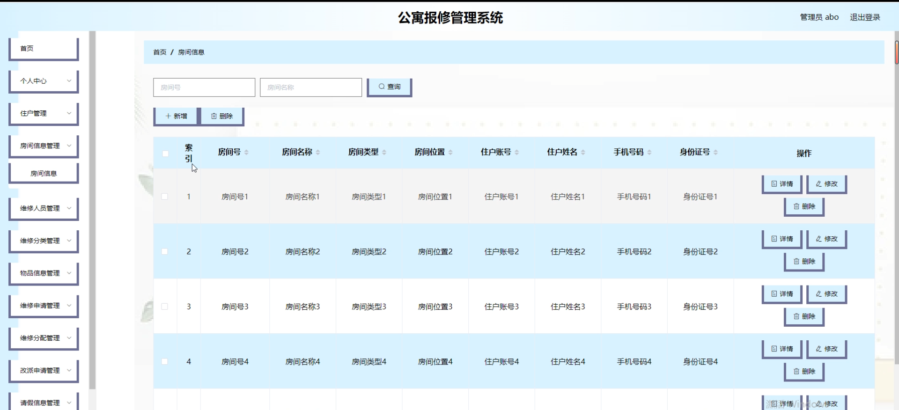

维护人员管理

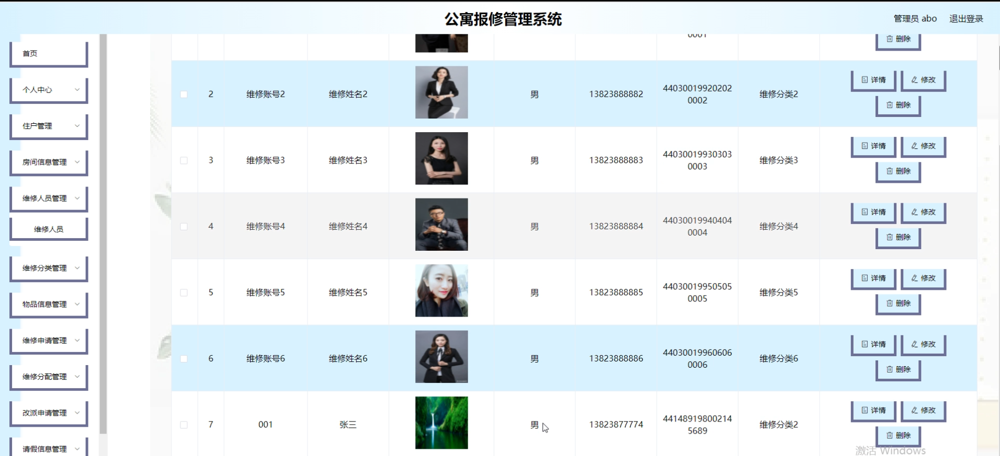

物品信息管理

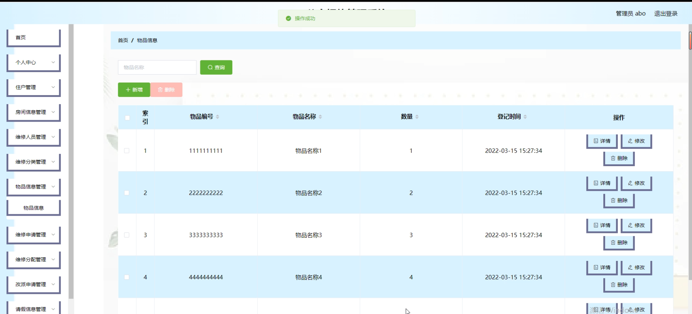

维修申请管理

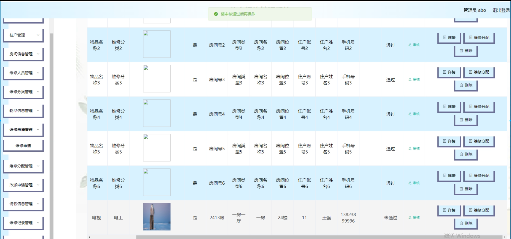

维修人员端维修分配管理

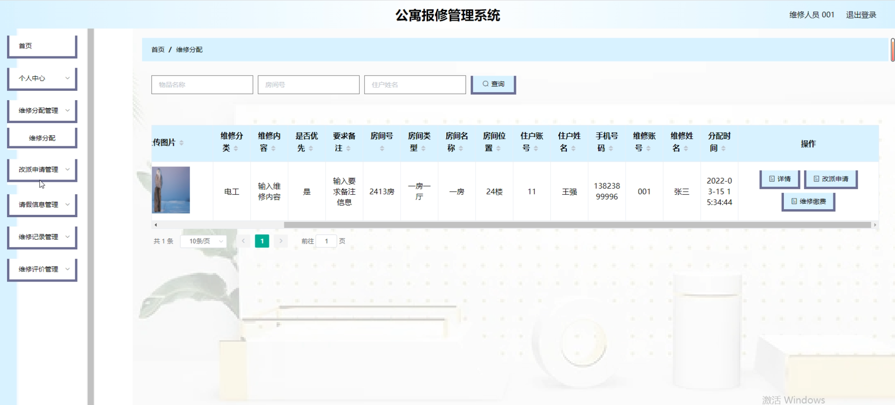

维修记录管理

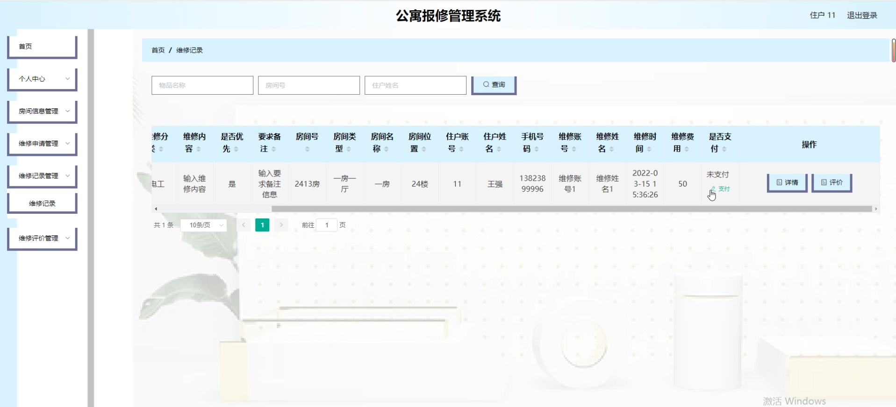

请假信息管理

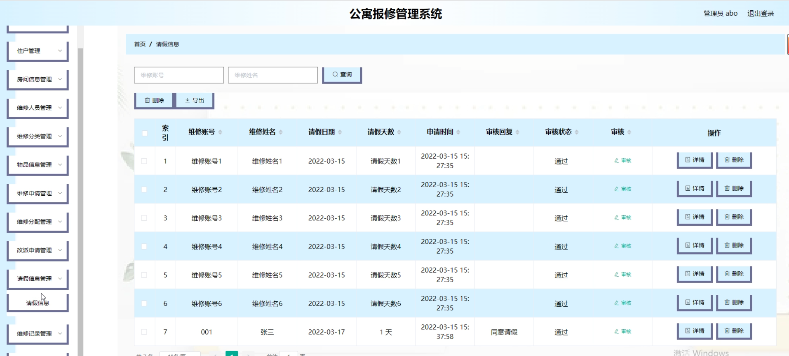

维修信息详情

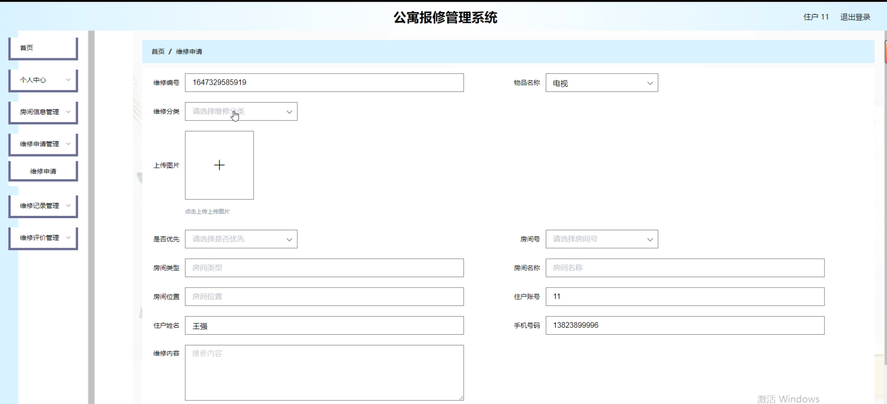

维修分类管理

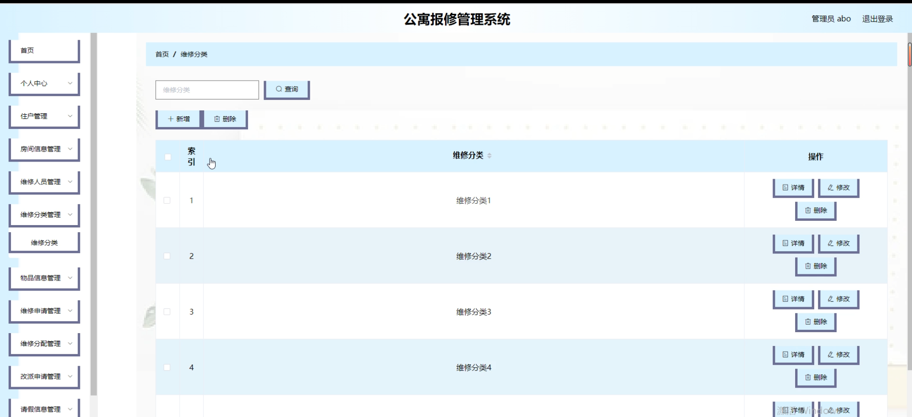

房间信息管理

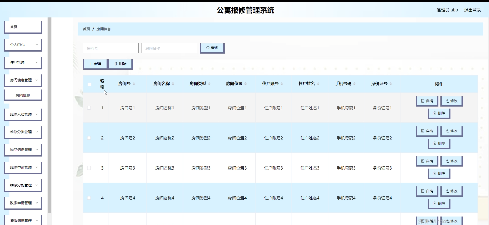

#### 总结

基于 Java 的公寓报修管理系统为公寓的维修管理提供了全面的解决方案。然而，系统在实际运行中可能会面临一些挑战，如网络故障对系统的影响、维修人员的实时定位功能的缺失、与其他公寓管理系统的集成难度等。未来，我们将不断完善系统功能，加强系统的稳定性和兼容性，提高用户体验，为公寓的高效管理和优质服务提供更有力的支持。

#### 使用说明

创建数据库，执行数据库脚本 修改jdbc数据库连接参数 下载安装maven依赖jar 启动idea中的springboot项目

后台地址
http://localhost:8080/springboot3lx4p/admin/dist/index.html

管理员  abo 密码 abo
